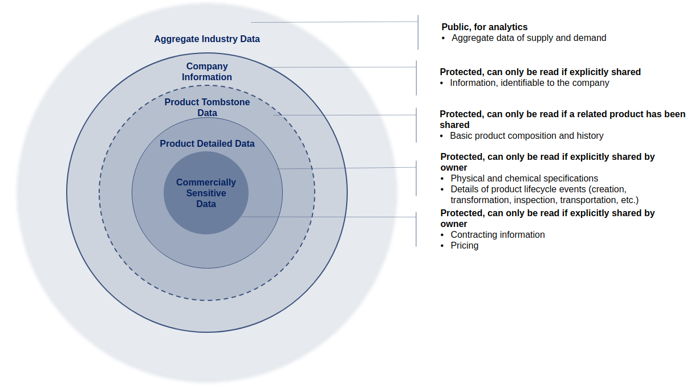

# Data Governance

The Neoflow ecosystem depends on industry and government stakeholders working together to enable the creation of a digital representation of an asset complete with lifecycle events and attributes. In this way, a viable ecosystem necessitates value chain participants who are actively part of the business workflow, read, write and commit data to the platform. These participants may run their own blockchain nodes or may have their nodes operated by Neoflow. In addition, there will be value chain ecosystem users who leverage data for the purposes of regulation, value chain monitoring or to gain market intelligence.

The table below outlines the different network participants, their roles and permissions within the system, as well as examples of their function in the Oil & Gas value chain.

| | System Roles | Permissions | Role within the Oil & Gas Value Chain |
| - | - | - | - |
| **Value Chain Participants** | Data providers, owners and users (node operators) | Read, write and commit transactions on the system | Oil & Gas producer, shipper, pipeline, custom broker, etc. |
| **Value Chain Ecosystem** | Data users | Access the system and see transactions for the purposes of monitoring | U.S. Customs and Border Protection (CBP) |
| **Technology providers** | Infrastructure and applications development, IT support and additional services | No read, write or transaction issuing permissions. Only access to sample data to enhance or roll out new features with data holders’ consent. No permission to share beyond consolidated industry reports and anomaly detection. | Third party service providers |

## Data Visibility  

To provide user with transparency on product lifecycle and business data, as well as ability to automate order, contract and digital border clearance, Neoflow stores five types of data. The diagram below illustrates the different layers of data and the respective access restrictions within the ecosystem. It is important to note that protected data never travels to other parties unless explicitly shared and public data is public only within Neoflow.

For the purposes of illustration, we have included some examples of the types of data that would fall under each bucket in the table below.

| Data Types | Description | Accessibility | Examples |
| - | - | - | - |
| **Product Tombstone Data** | Used for visualizing complete product lifecycle | Public within Neoflow | <ul><li>High level product composition and history</li></ul> |
| **Product Detailed Data** | Used for visualizing complete product lifecycle in details. Contains product sensitive data | Protected | <ul><li>Transformation events, specifications, locations and timestamps, etc.</li></ul> |
| **Commercially Sensitive Data** | Used for automating order, contract and border clearance. Contains commercially sensitive data | Private | <ul><li>Digital contract (parties, dates, volume, price, etc.) - co-owned by the two contracting parties</li><li>Import declaration</li></ul> |
| **Company Info** | Used for automating order, contract and border clearance | Protected | <ul><li>Company name, address, postal code, etc.</li></ul> |
| **Aggregate Data** | Used for data analytics and value chain insights | Public within Neoflow | <ul><li>Aggregated supply and demand data per period</li><li>General industry trends and analytics insights</li></ul> |

## Data Sharing and Accessibility 

For each network participants, Neoflow enforces strict rules listed in the below table for data privacy and accessibility. Neoflow also ensures that all Product Detailed Data owners can see which network participant holds a Degree-2 accessibility, and can grant and revoke the access at all times. 

<Table style="text-align: center;">
    <tr>
        <th rowspan="2">Network Participants</th>
        <th rowspan="2">Data Type</th>
        <th colspan="4">Permission</th>
    </tr>
    <tr>
        <th>Read if a related product has been shared (Degree-1)</th>
        <th>Read if the owner grants access explicitly (Degree-2)</th>
        <th>Can only read owned data (Degree-3)</th>
        <th>Read and download (Degree-4)</th>
    </tr>
    <tr>
        <td rowspan="5"><b>Value Chain Stakeholders</b></td>
        <td>Product Tombstone Data</td>
        <td>*</td>
        <td></td>
        <td></td>
        <td></td>
    </tr>
    <tr>
    <td>Product Detailed Data</td>
        <td></td>
        <td>*</td>
        <td></td>
        <td></td>
    <tr>
    <td>Commercially Sensitive</td>
        <td></td>
        <td></td>
        <td>*</td>
        <td></td>
    <tr>
        <td>Company Info</td>
        <td></td>
        <td></td>
        <td>*</td>
        <td></td>
    </tr>
    <tr>
        <td>Aggregated Data</td>
        <td></td>
        <td></td>
        <td></td>
        <td>*</td>
    </tr>
    <tr>
        <td rowspan="4"><b>Value Chain Ecosystem</b></td>
        <td>Product Tombstone Data</td>
        <td>*</td>
        <td></td>
        <td></td>
        <td></td>
    </tr>
    <tr>
        <td>Product Detailed Data</td>
        <td></td>
        <td>*</td>
        <td></td>
        <td></td>
    <tr>
        <td>Commercially Sensitive</td>
        <td></td>
        <td>*</td>
        <td></td>
        <td></td>
    <tr>
        <td>Aggregated Data</td>
        <td></td>
        <td></td>
        <td></td>
        <td>*</td>
    </tr>
    <tr>
        <td rowspan="5"><b>Technology Providers</b></td>
        <td>Product Tombstone Data</td>
        <td rowspan="5" colspan="4">Permitted to collect and use the data samples to support Neoflow features;   NOT Permitted to share with 3rd parties beyond consolidated industry reports and anomaly detection</td>
    </tr>
    <tr>
        <td>Product Detailed Data</td>
    <tr>
        <td>Commercially Sensitive</td>
    <tr>
        <td>Company Info</td>
    </tr>
    <tr>
        <td>Aggregated Data</td>
    </tr>
</Table>