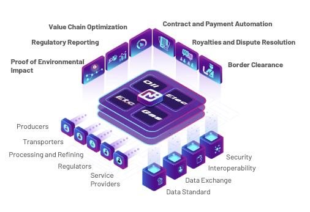
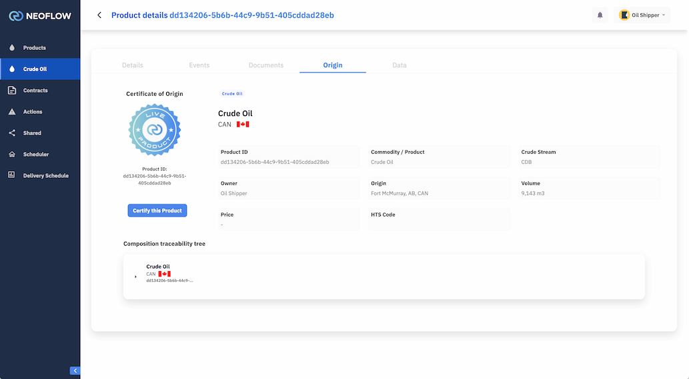
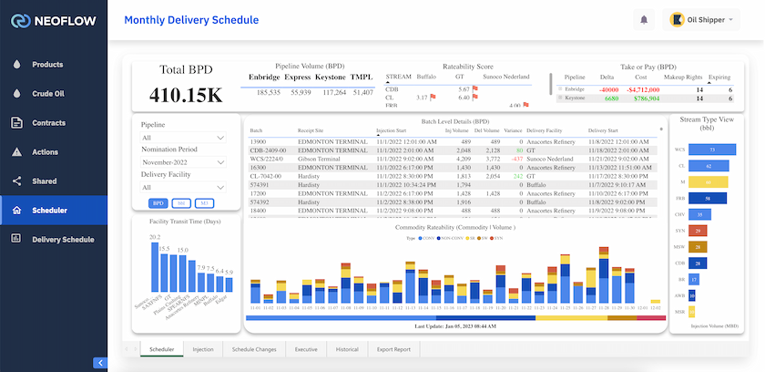

# Platform Overview

Neoflow is a platform that allows users to create digital credentials of energy commodities with verifiable and end-to-end information of lifecycle events, attributes, ownership, custody, origin and location. 

Relevant information in the value chain of a commodity, such as bills of lading, delivery tickets, certificates of origin, among others, are digitized to streamline data exchange and automate regulatory and import reporting processes. 

{: .center }

Neoflow creates a standards-based protocol for exchange of digital data representing an energy commodity. At its core, the platform is based on a combination of consortium blockchain and emerging W3C standards of Decentralized Identifiers ([DID](https://www.w3.org/TR/did-core/)) and Verifiable Credentials ([VC](https://www.w3.org/TR/vc-data-model/)).

The use of blockchain, VC, and DID standards allows various value chain stakeholders (Producers, Transporters, Refineries, Regulators and Service Providers) to safely and securely exchange data in a standardized manner. The end result is a digital representation of the commodity, it's attributes and lifecycle history that is built together and verified by multiple applicable stakeholders. 

A common digital representation of the physical commodity (a digital twin, or a digital passport) in turn enables a variety of digital innovations, or use cases that would otherwise be not feasible.

The following are the key features that the platform supports.

## Events

In the context of Neoflow, a Neoflow event is intended to digitally represent a specific physical event in the lifecycle of an energy commodity (extraction, dilution, pooling, refinement). Along with event-specific attributes, a Neoflow event captures the date, time, and location of the event as well as a cryptographic link to the DID of the organization that published the event. 

The lifecycle of the commodity is mapped with below set of supply chain events on the Neoflow platform. These events are compatible with [GS1 EPCIS](https://www.gs1.org/standards/epcis).

* Creation of commodity (or product)
* Transformation
* Inspection
* Transfer of Ownership
* Transfer of Custody
* In-Bond
* Transportation
* Storage

Events are exposed as Verifiable Credentials that are self-issued by the event creator and are defined on the [Traceability-Vocab](https://github.com/w3c-ccg/traceability-vocab).

## Proof of Origin & Composition  

Production and transformation records are standardized and updated in real-time. Neoflow's underlying blockchain technology enables the creation of a trusted digital history that is attested by each party in the value chain and is impossible to forge. 

Each data element, timestamp and actor in the digital certificate of origin and composition is cryptographically proven and can be easily verified by independent actors (e.g., border control, regulatory agencies, external auditors). 

### Certificate of Origin

The certificate of origin includes relevant product attributes such as HS code, physical and chemical product specifications, type of commodity, volume, among others. 

The lifecycle of the product is presented to outline its detailed composition from previous transformation events, along with details of the products that were used in its transformation. 

{: .center }

## Real-Time Analytics

The core functionality of Neoflow provides trusted real-time data. Coupled with analytics, this provides users with actionable insights such for:
* Evidence-based policy making
* Descriptive and predictive insights specific to supply and demand management
* Detection and alerts of anomalies in real-time

### Details

Neoflow has pre-built dashboards that are customizable and provide granular data, specific to an organization's role in the value chain and a user's role. In this way, visualizing and responding dynamically to events or alerts is easier and faster.  

{: .center }